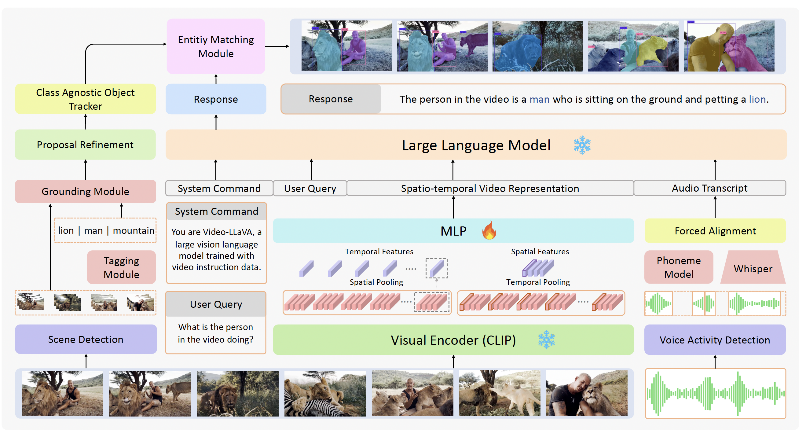
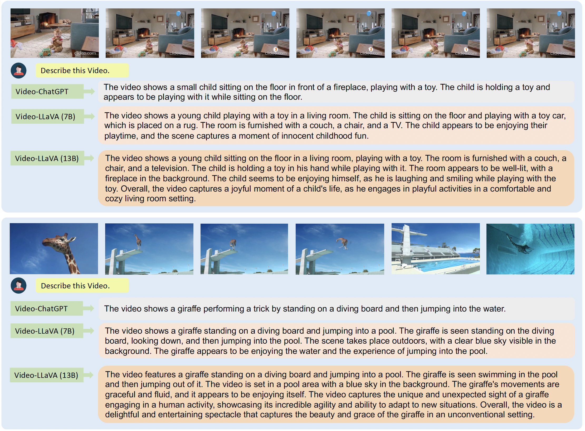
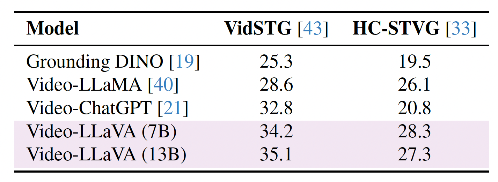
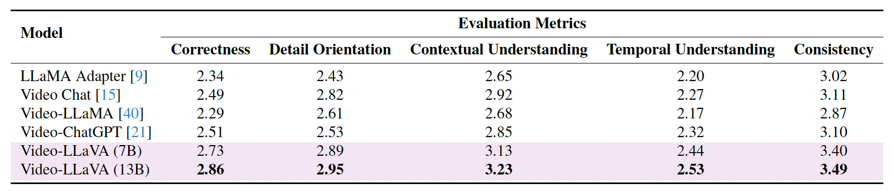
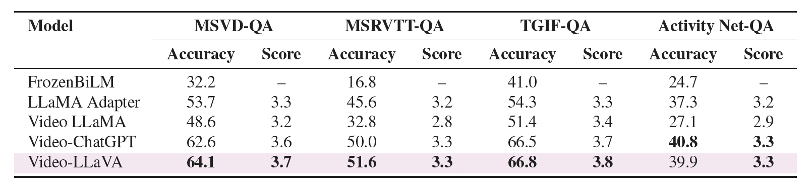

#   PG-Video-LLaVA: Pixel Grounding in Large Multimodal Video Models


[Shehan Munasinghe](https://shehanmunasinghe.github.io/)* , [Rusiru Thushara](https://thusharakart.github.io/)* , [Muhammad Maaz](https://www.muhammadmaaz.com/) , [Hanoona Rasheed](https://www.hanoonarasheed.com/), [Salman Khan](https://salman-h-khan.github.io/), [Mubarak Shah](https://www.crcv.ucf.edu/person/mubarak-shah/),  [Fahad Shahbaz Khan](https://scholar.google.es/citations?user=zvaeYnUAAAAJ&hl=en). 

*Equal Contribution

**Mohamed bin Zayed University of Artificial Intelligence, UAE**

[](https://mbzuai-oryx.github.io/Video-LLaVA/)
[](https://arxiv.org/abs/2311.13435)

---

## 📢 Latest Updates
- 📦 27-Dec-2023: Code, models released! 🚀
---

##   Overview

PG-Video-LLaVA is the first video-based Large Multimodal Model (LMM) with pixel-level grounding capabilities. 🔥🔥🔥

<p align="center">
  
</p>

---
## 🏆 Contributions

The key contributions of this work are:

- We propose PG-Video-LLaVA, **the first video-based LMM with pixel-level grounding capabilities**, featuring a modular design for enhanced flexibility. Our framework uses an off-the-shelf tracker and a novel grounding module, enabling it to spatially ground objects in videos following user instructions.

- We introduce a **new benchmark specifically designed to measure prompt-based object grounding performance**.

- By incorporating audio context, PG-Video-LLaVA significantly **enhances its understanding of video content**, making it more comprehensive and aptly suited for scenarios where the audio signal is crucial for video understanding (e.g., dialogues and conversations, news videos, etc.).

- We introduce **improved quantitative benchmarks** for video-based conversational models. Our benchmarks utilize open-source Vicuna LLM to ensure better reproducibility and transparency. We also propose benchmarks to evaluate the grounding capabilities of video-based conversational models.

---

##  PG-Video-LLaVA : Architecture


<p align="center">
  
</p>

---

## Installation and CLI Demo

For installation and setting up the CLI demo, please refer to the instructions [here](/docs/1-CLI_DEMO.md).

---

## Training

For training, please refer to the instructions [here](/docs/2-Training.md).

---

## Qualitative Analysis 🔍

### Video Grounding 🎯

Our framework uses an off-the-shelf tracker and a novel grounding module, enabling it to localize objects in videos following user instructions.

<p align="center">
  
</p>

---

### Including Audio Modality 🎧

By incorporating audio context, PG-Video-LLaVA significantly enhances its understanding of video content, making it more comprehensive and aptly suited for scenarios where the audio signal is crucial for video understanding (e.g., dialogues and conversations, news videos, etc.).

<p align="center">
  
</p>

---

### Video-ChatGPT vs PG-Video-LLaVA

PG-Video-LLaVA is based on a stronger image-LMM baseline which gives it better conversational ability compared to its predecessor. 

<p align="center">
  
</p>


---

##  Quantitative Evaluation 📊

We evaluate PG-Video-LLaVA using video-based generative and question-answering benchmarks. We also introduce new benchmarks specifically designed to measure prompt-based object grounding performance in videos.

### Video Grounding 🎯

To quantitatively assess PG-Video-LLaVA’s spatial grounding capability, we conducted quantitative evaluations of PG-Video-LLaVA’s spatial grounding capabilities using two benchmarks that are derived from the test set of the VidSTG and HC-STVG datasets.

For detailed instructions on performing quantitative evaluation on video grounding, please refer [this](/grounding_evaluation/README.md).


<p align="center">
  
</p>

---

### Video-based Generative Performance Benchmarking 🤖

We apply the benchmarking framework from Video-ChatGPT which measures performance on several axes critical for video-based conversational agents, including correctness of information, detail orientation, contextual understanding, temporal understanding, and consistency. In order to facilitate a reliable and reproducible evaluation, we have updated our assessment pipeline by replacing GPT-3.5 with Vicuna-13b-v1.5.

<p align="center">
  
</p>

---

### Zero-Shot Question Answering 💬

Zero-shot question-answering (QA) capabilities were evaluated quantitatively using several established open-ended QA datasets: MSRVTT-QA, MSVD-QA, TGIF-QA, and ActivityNet-QA.

<p align="center">
  
</p>

For detailed instructions on video-based generative performance benchmarking and zero-shot question answering benchmark, please refer [this](/quantitative_evaluation/README.md).

---

## Acknowledgements 🙏

+ [LLaMA](https://github.com/facebookresearch/llama): a great attempt towards open and efficient LLMs!
+ [Vicuna](https://github.com/lm-sys/FastChat): has the amazing language capabilities!
+ [LLaVA](https://github.com/haotian-liu/LLaVA): our architecture is inspired from LLaVA.
+ [Video-ChatGPT](https://github.com/mbzuai-oryx/Video-ChatGPT): the predecessor to PG-Video-LLaVA

---

## Citation 📜

If you're using PG-Video-LLaVA in your research or applications, please cite using this BibTeX:

```bibtex
  @article{munasinghe2023PGVideoLLaVA,
        title={PG-Video-LLaVA: Pixel Grounding Large Video-Language Models}, 
        author={Shehan Munasinghe and Rusiru Thushara and Muhammad Maaz and Hanoona Abdul Rasheed and Salman Khan and Mubarak Shah and Fahad Khan},
        journal={ArXiv 2311.13435},
        year={2023}
  }
```

---

[](https://www.ival-mbzuai.com)
[](https://github.com/mbzuai-oryx)
[](https://mbzuai.ac.ae)
